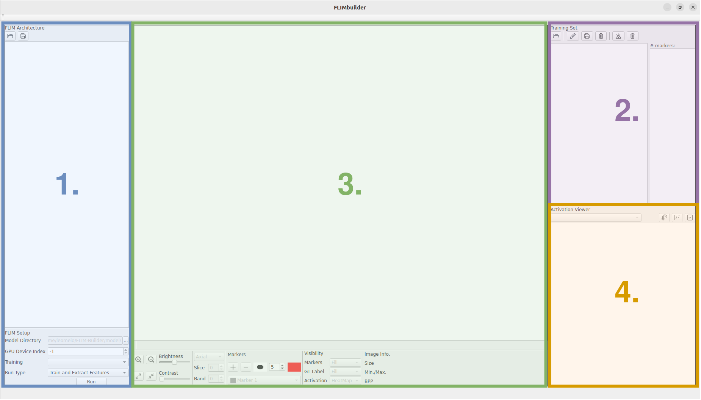
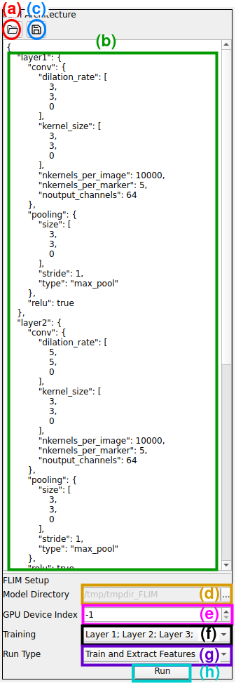
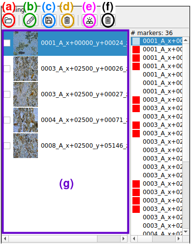
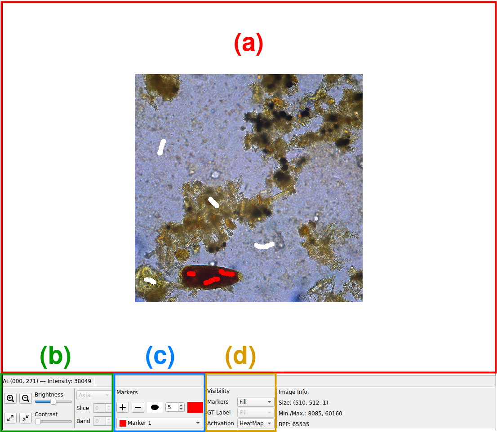
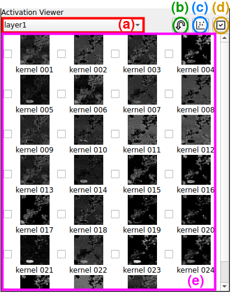

# FLIM-Builder

This is the official repository of the software FLIM-Builder. FLIM-Builder provides an interface for training FLIM-based CNNs. In FLIM Builder, the user can define the network architecture, load and annotate the dataset, train the CNN using FLIM, see each kernel's activation (and manually select them if desired), and run on the validation set.

## Installing
### Requirements
These packages are required for a successful compilation.
- GCC 4.9+
- ATLAS
- LAPACK
- BLAS
- Qt 6.3.1+
  
And they can be installed on Ubuntu by:

```console
apt install build-essential
apt install libatlas-base-dev liblapack-dev libopenblas-dev
apt install qt6-base-dev
```

#### For running with GPU:
Install cuda-toolkit from NVIDIA

### Compiling
To generate a Makefile, simply run:
```console
qmake6 FLIMBuilder.pro <OPTIONS=use_gpu>
```

Add the optional OPTIONS=use_gpu flag for enabling GPU (you must have cuda-toolkit working)

Then, run:
```console
make .
```

## How to use
(Considering *Navigating FLIMBuilder*, the module you should interact with for every action is in parenthesis.)

#### A **simple step-by-step** without much user interaction would be:

a) Define a CNN architecture and a folder to save the model (1.);

b) Load a dataset (2.);

c) Load/add scribbles to the training images (2./3.);

d) Train and execute all layers (1.);

e) Load the validation/test data (2.);

f) Run the learned model (1.).

## Navigating FLIMBuilder
We splitted FLIMBuilder in four parts to present them separately.





<div style="padding-top: 110px;padding-bottom: 110px;">
1) Architecture and Experimental Setup:

    (a) Load an architecture setup;
    (b) Area to change the architecture file;
    (c) Save the architecture file;
    (d) Set a directory to save the model and the results;
    (e) Define which device to run the model (-1 for CPU);
    (f) Define which layer to train/run;
    (g) Select whether to train, run, or both;
    (h) Run the model with all set configurations.
</div>


<div style="padding-top: 60px;padding-bottom: 60px;">
  2) Dataset manipulation:

      (a) Load Image dataset;
      (b) Load previously saved scribbles;
      (c) Save new scribbles;
      (d) Delete all scribbles;
      (e) Load pixel-wise ground-truth;
      (f) Unload pixel-wise ground-truth;
      (g) Look at dataset images
      (Double-click one to select it for annotation or to see its activations).
</div>



<div style="padding-top: 30px;padding-bottom: 30px;">
  3) Image annotation:

      (a) Image panel to view images and activations and add scribbles;
      (b) Image manipulation options
      (c) Marker options to change their size or label
      (d) Visualization and annotation options.
</div>




<div style="padding-top: 50px;padding-bottom: 50px;">
  4) Kernel Activation visualization:

      (a) Layer Selection
      (b) Invert the activations of selected kernels
      (c) Visualize projection of the kernels' feature space using TSNe
      (d) Confirm a kernel selection (remove all other kernels).
      (e) Kernel panel
      (Double-click kernels to look at their activation in the image panel (3.). Also, click on the checkboxes to select kernels.
</div>
